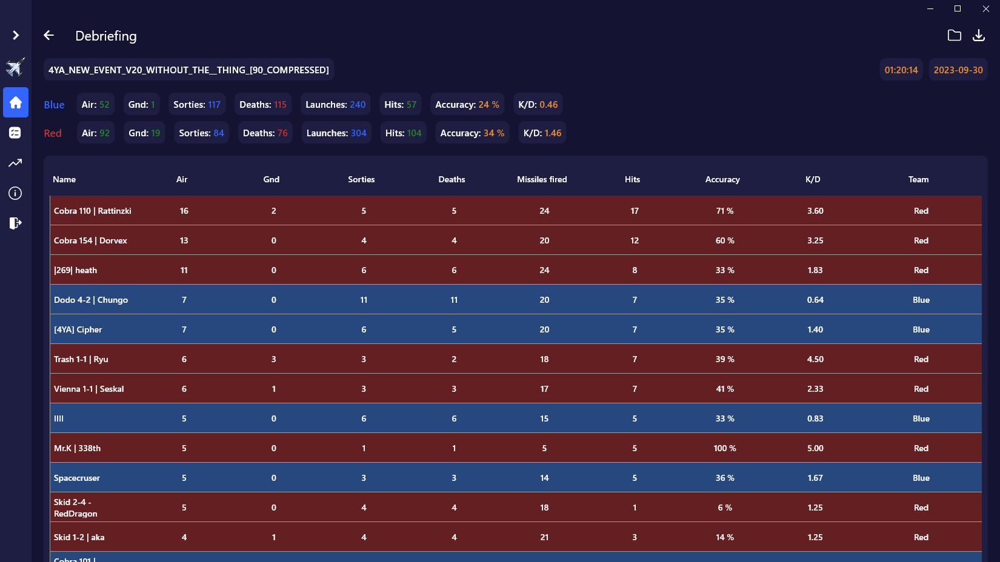
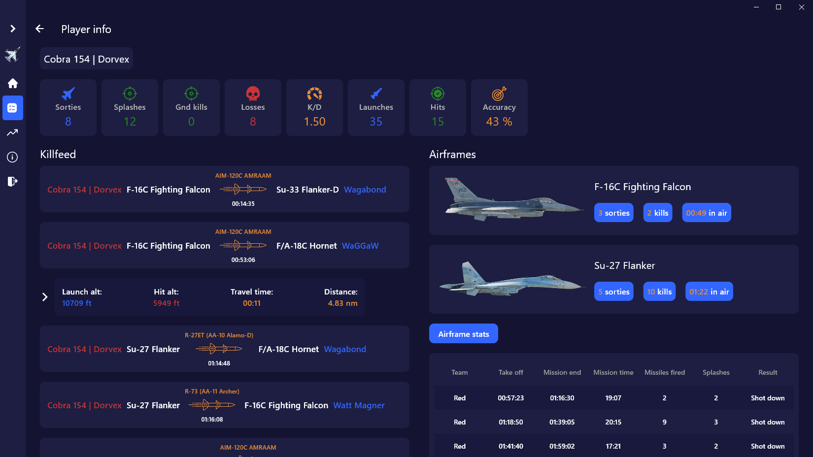
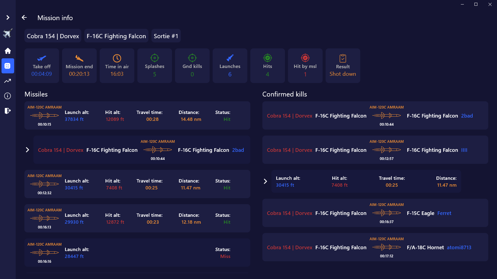

# FlyStats DCS

**FlyStats DCS** is a Windows application for viewing and analysis of your gameplay statistics from the DCS World game. This app uses **.acmi** files from Tacview for data import.

## Downloads

## App Features
- Detailed player, aircraft, sortie and missile statistics
- Match score table, supports filtering, sorting and export to image
- Authorization and ability to save player statistics, as well as match statistics
- Authorized users can track their data across all of their matches, supports date filtering
- Tracking of destroyed air and ground targets, guns kills, launched missiles and other munitions
- Graphs for missile statistics: Splashes/Distance, Splashes/Launch_altitude, Accuracy/Launch_altitude

## How to import replays data
- Open your original **.acmi** file in Tacview
- In Tacview app Select File -> Export Flight Log
- Save file to any location, make sure file format is "XML Flight Log"
- In FlyStats app press "Import" and select your created file in .XML format

Don't have tacview? You can download it here: [Tacview Website](https://www.tacview.net/)

## Screenshots

Match scoreboard

Player saved matches 

Player statistics

Aircraft statistics

Aircraft sorties statistics

Sortie statistics

## Statistics notes
- Due to Fligh Log limitations missile travel distance is calculated as distance between launch point and hit point in 3D space and can be referenced as "Estimate missile travel distance".
- Accuracy parameter only includes data gathered from missiles, bombs and other launchable munitions, excluding gun kills.
- Missiles that hit other missiles are not counted in hits, accuracy, or kills statistics.
- If player switched teams in a match, the last one of them will be displayed in the match score table. However, in the player's sortie statistics you can see which team exactly he played.
- If player damaged ground target, but it has not been destroyed - it will be marked as "damaged" in sortie killfeed.

## Feedback & Bug Reports

If you have any feedback, please reach out to me in Discord [dorvex.](https://discordapp.com/users/dorvex.) (With .)\
You can also create feature request or bug report at the repo [GitHub Issues](https://github.com/Dorvex/FlyStats-DCS-Public/issues)

## Data Usage

This app uses Google Oauth 2.0, which does not gives your password in any way.
You can read more about Google Oauth 2.0 here:
[Google Oauth 2.0 Documentation](https://cloud.google.com/apigee/docs/api-platform/security/oauth/oauth-introduction#:~:text=%22The%20OAuth%202.0%20authorization%20framework,obtain%20access%20on%20its%20own)

After sucessfull authentification using Google app recieves your private auth token (a way to link your data to your google account). 
After this email, google profile picture link is encrypted by app and cached locally for the purpose you displaying them in app.

If you are logged in you can specify your in-game callsign to ease the process of finding yourself in match scoreboard and uploading your replays faster. Callsign is also stored on app server.

You can delete all local data just by logging out of the app or deleting “FlyStats DCS” folder in your “Documents” folder.

You can upload your replays to cloud, using upload button. After this your replay data will be stored on server in your private folder. Other users of the app CAN NOT access your data by any means.

Data stored on app server:

- If user has logged in: [oauth_token], [callsign], [internal_uid]
- If user has uploaded any replays: [replays_data ], [player_statistics_data]

Encrypted data stored locally on your machine: 

- If user has logged in: [email], [profile_picture_url], [callsign].

Data stored locally on your machine: 
  
- If user has uploaded any replays: [replays_data]
  
Data holder does not provide access, share, sell, or distribute your data to any companies. Data is securely stored on dedicated server.
Currently you can request archive with all of your data | data deletion by writing an email to dev.alexche@gmail.com.

[Privacy policy](https://www.iubenda.com/privacy-policy/40963970)
